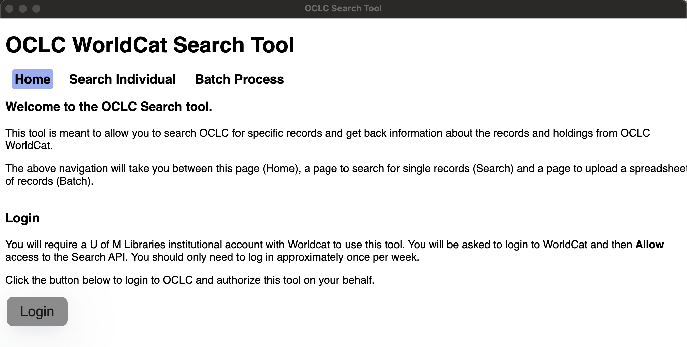
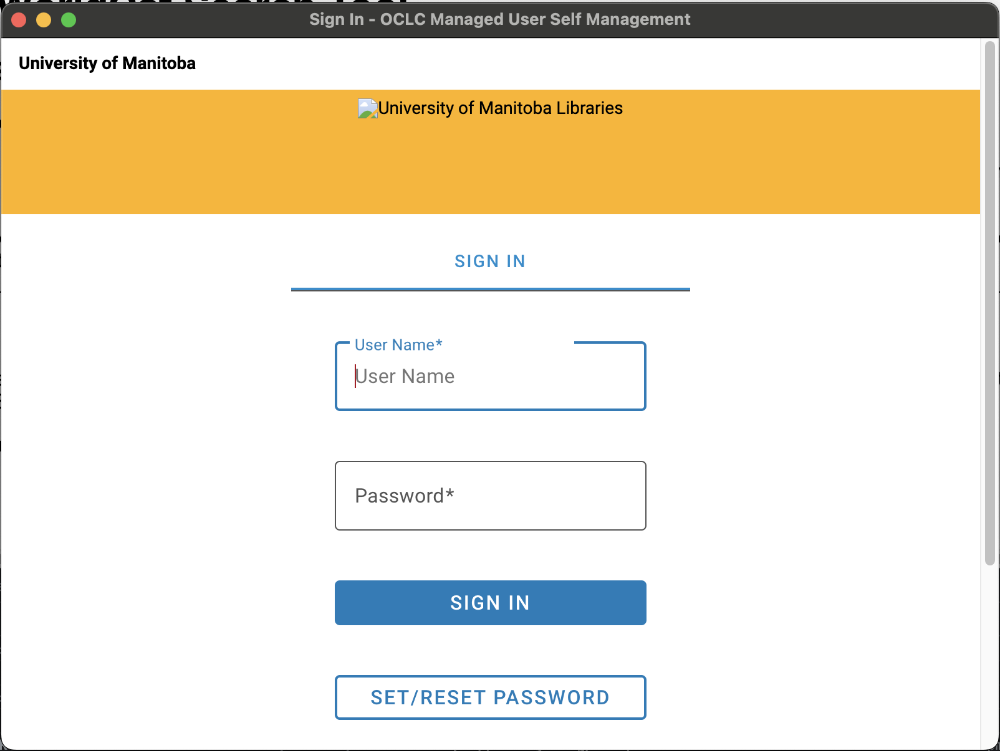
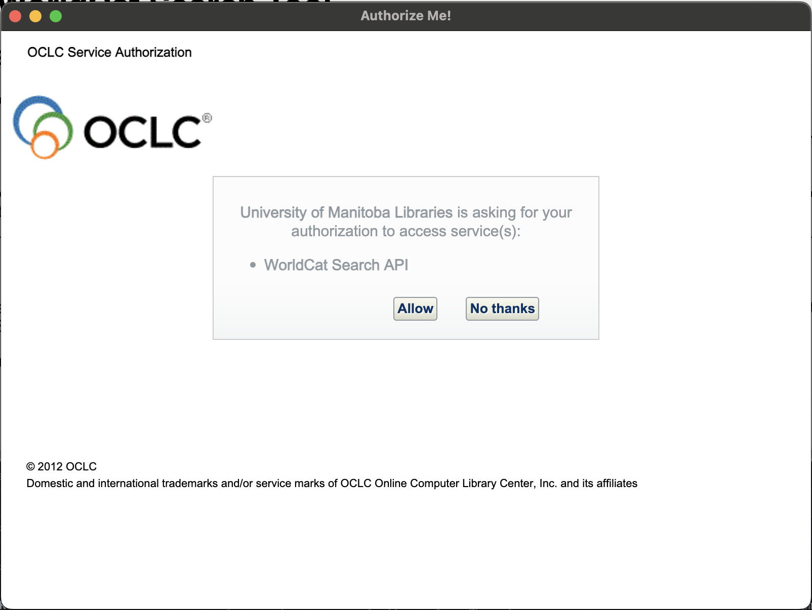

<p>
  OCLC WorldCat Search is built on [Electron React Boilerplate](https://electron-react-boilerplate.js.org/). It deploys as a small desktop application to perform single or batch searches of OCLC WorldCat Bibliographic holdings records.
</p>

## Usage

To use this application you will need an institutional login for OCLC Worldcat.

Start the application.

On the Homepage you will either see a grey "Login" button or the message "Already logged in". 

### Login

If you see the "Login" button, <b>click</b> it. A new window will open and display the OCLC login screen.



<i>Note</i>: The University of Manitoba Libraries logo is broken because it has been deleted on the U of M's webserver and OCLC has not been updated. This same missing logo appears if you go direct to the OCLC Developer Network WSKey user interface https://platform.worldcat.org/wskey/.

Enter your credentials and click <b>Sign In</b>.

You will then be prompted to allow access to the <i>WorldCat Search API</i>. 



Click <b>Allow</b>. The window should close and the above "Already logged in" should now appear.

### Navigation

There are 3 screens to this whole application. Home (which provides the Login button), Search Individual for performing an adhoc search and Batch Process to process records in an Excel spreadsheet.

### Search Individual

This screen allows you to choose between searching using an OCLC Control Number, ISBN or ISSN. Select the desired option, then enter the number and click the Search button. 

A result will appear below if one is found.

Click the "Show Help" to display some simple help.

### Batch Process

This screen allows you to upload a spreadsheet. The spreadsheet is expected to have headers in the first row and at least one column header must contain the words "OCLC Control Number" or "ISBN" or "ISSN". If you have multiple columns with these words (i.e. "ISBN" and "Normalize ISBN"), the right most column is chosen.

For each following row of the spreadsheet a query is generated and sent to WorldCat, the results are stored and displayed below.

You can then <b>Save Data</b> to produce a new spreadsheet with all the found data. 

You can also filter out U of M holdings from the spreadsheet by checking the "Filter local holdings from output" checkbox.


## Install for development

Clone the repo and install dependencies:

```bash
git clone --branch main git@scm.ad.umanitoba.ca:external/libraries/general/oclc-worldcat-search.git
cd oclc-worldcat-search
npm install
```

## Starting Development

Start the app in the `dev` environment:

```bash
npm run start
```

## Packaging for Production

To package apps for the local platform:

```bash
npm run package
```

To package apps for both OSX (x86 and ARM) and Windows platforms.

```bash
npm run package-all
```

Installers will be produced in the `./release/build` directory.


## License

MIT © [Electron React Boilerplate](https://github.com/electron-react-boilerplate)
